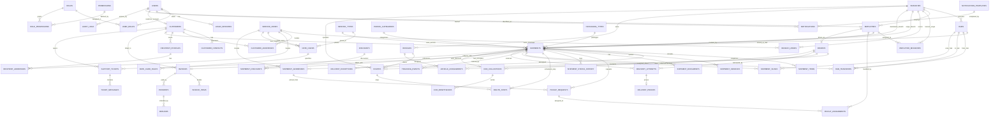

# Entity Relationship Diagram (ERD) — 55 Business Tables

This Mermaid diagram shows all 55 business tables and their primary relationship links within the Smart Courier system.

```mermaid
erDiagram
    %% GROUP A: AUTH & ACCESS
    USERS ||--o{ USER_ROLES : has
    ROLES ||--o{ USER_ROLES : assigned_in
    ROLES ||--o{ ROLE_PERMISSIONS : grants
    PERMISSIONS ||--o{ ROLE_PERMISSIONS : defined_by
    USERS ||--o{ LOGIN_SESSIONS : starts

    %% GROUP B: ORG & EMPLOYEES
    BRANCHES ||--o{ HUBS : operates
    BRANCHES ||--o{ EMPLOYEES : employs
    USERS ||--o| EMPLOYEES : identified_as
    EMPLOYEES ||--o{ EMPLOYEE_BRANCHES : assigned_to
    BRANCHES ||--o{ EMPLOYEE_BRANCHES : branch_scope
    BRANCHES ||--o{ BRANCH_ZONES : covers
    SERVICE_ZONES ||--o{ BRANCH_ZONES : zone_coverage

    %% GROUP C: CUSTOMERS & CATALOG
    USERS ||--o| CUSTOMERS : customer_account
    CUSTOMERS ||--o{ CUSTOMER_CONTACTS : has
    CUSTOMERS ||--o{ CUSTOMER_ADDRESSES : maintains
    SERVICE_ZONES ||--o{ CUSTOMER_ADDRESSES : locates
    CUSTOMERS ||--o{ RECIPIENT_PROFILES : saves
    RECIPIENT_PROFILES ||--o{ RECIPIENT_ADDRESSES : has
    SERVICE_ZONES ||--o{ RECIPIENT_ADDRESSES : locates
    SERVICE_TYPES ||--o{ RATE_CARDS : priced_in
    SERVICE_ZONES ||--o{ RATE_CARDS : origin_zone
    SERVICE_ZONES ||--o{ RATE_CARDS : dest_zone
    RATE_CARDS ||--o{ RATE_CARD_RULES : specifies

    %% GROUP D: SHIPMENTS & BOOKING
    CUSTOMERS ||--o{ SHIPMENTS : places
    BRANCHES ||--o{ SHIPMENTS : origin_branch
    BRANCHES ||--o{ SHIPMENTS : destination_branch
    SERVICE_TYPES ||--o{ SHIPMENTS : uses_service
    PARCEL_CATEGORIES ||--o{ SHIPMENTS : categorizes
    PACKAGING_TYPES ||--o{ SHIPMENTS : packages
    EMPLOYEES ||--o{ SHIPMENTS : booked_by
    HUBS ||--o{ SHIPMENTS : stored_at_hub
    SHIPMENTS ||--o{ SHIPMENT_ITEMS : includes
    SHIPMENTS ||--o{ SHIPMENT_ADDRESSES : snapshots
    SERVICE_ZONES ||--o{ SHIPMENT_ADDRESSES : locates
    SHIPMENTS ||--o{ SHIPMENT_SERVICES : quotes
    SHIPMENTS ||--o{ SHIPMENT_DOCUMENTS : has
    SHIPMENTS ||--o{ PICKUP_REQUESTS : requests
    SHIPMENT_ADDRESSES ||--o{ PICKUP_REQUESTS : picked_from
    PICKUP_REQUESTS ||--o{ PICKUP_ASSIGNMENTS : assigned_to
    EMPLOYEES ||--o{ PICKUP_ASSIGNMENTS : handled_by
    SHIPMENTS ||--o{ SHIPMENT_STATUS_HISTORY : logs

    %% GROUP E: DISPATCH & DELIVERY
    EMPLOYEES ||--o| DRIVERS : drives_as
    BRANCHES ||--o{ VEHICLES : owns
    BRANCHES ||--o{ ROUTES : operates
    DRIVERS ||--o{ ROUTES : conducts
    VEHICLES ||--o{ ROUTES : drives
    VEHICLES ||--o{ VEHICLE_ASSIGNMENTS : assigned
    DRIVERS ||--o{ VEHICLE_ASSIGNMENTS : assigned_driver
    ROUTES ||--o{ ROUTE_STOPS : stops
    SHIPMENTS ||--o{ ROUTE_STOPS : scheduled_stop
    SHIPMENTS ||--o{ HUB_TRANSFERS : transfers
    HUBS ||--o{ HUB_TRANSFERS : from_hub
    HUBS ||--o{ HUB_TRANSFERS : to_hub
    SHIPMENTS ||--o{ SHIPMENT_SCANS : scanned
    HUBS ||--o{ SHIPMENT_SCANS : scan_hub
    SHIPMENTS ||--o{ TRACKING_EVENTS : tracked_by
    SHIPMENTS ||--o{ DELIVERY_ATTEMPTS : attempted
    DRIVERS ||--o{ DELIVERY_ATTEMPTS : attempted_by
    DELIVERY_ATTEMPTS ||--o| DELIVERY_PROOFS : proves
    SHIPMENTS ||--o{ DELIVERY_EXCEPTIONS : has_exception

    %% GROUP F: FINANCE & PAYMENTS
    SHIPMENTS ||--o| INVOICES : billed_with
    CUSTOMERS ||--o{ INVOICES : billed_to
    INVOICES ||--o{ INVOICE_ITEMS : details
    INVOICES ||--o{ PAYMENTS : paid_by
    PAYMENTS ||--o{ REFUNDS : refunded_by
    DISCOUNTS ||--o{ SHIPMENT_DISCOUNTS : discounted
    SHIPMENTS ||--o{ SHIPMENT_DISCOUNTS : uses_discount
    SHIPMENTS ||--o| COD_COLLECTIONS : collects_cod
    DRIVERS ||--o{ COD_COLLECTIONS : driver_collected
    COD_COLLECTIONS ||--o{ COD_REMITTANCES : remits

    %% GROUP G: SUPPORT & AUDIT
    CUSTOMERS ||--o{ SUPPORT_TICKETS : opens
    SHIPMENTS ||--o{ SUPPORT_TICKETS : references
    SUPPORT_TICKETS ||--o{ TICKET_MESSAGES : contains
    USERS ||--o{ NOTIFICATIONS : alerted
    NOTIFICATION_TEMPLATES ||--o{ NOTIFICATIONS : templated_by
    USERS ||--o{ AUDIT_LOGS : actions_by
```
